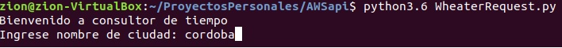

# AWSapi
<!DOCTYPE html>
<html>
<body>

<p><strong>Dependencias necesarias:</strong></p>
<h2>Paquetes necesarios y recomendados</h2>
<ul>
  <li>(Necesario)serverless</li>
  <li>(Sugerido) GIT</li>
  <li>(Sugerido) curl</li>
</ul>  
<p><b>Instalación de Serverless:</b></p>
```
curl -o- -L https://slss.io/install | bash
```
En el presente directorio, se deberá ejecutar el siguiente comando:
```
serverless create --template aws-python3
```
Se deberán configurar los datos de accesos a AWS
```
serverless config credentials --provider aws --key "personalKey" --secret "personalSecret" --overwrite
```
Ademas, se deberá configurar el rol dentro de serverless.yml

Ejemplo:    <p><i>role: arn:aws:iam::ID:role/ServRoleName</i></p>

El despliegue se realizará con las siguiente orden:
```
serverless deploy
```
El resultado que devolverá contendrá el link de acceso a la API, este se deberá agregar al codigo de la app <p><i>LambdaClima.py</i></p>

Este se ejecuta: 
```
python3 LambdaClima.py
```
Se deberá ingresar el nombre de una ciudad a consultar.
Ejemplo:



</body>
</html>